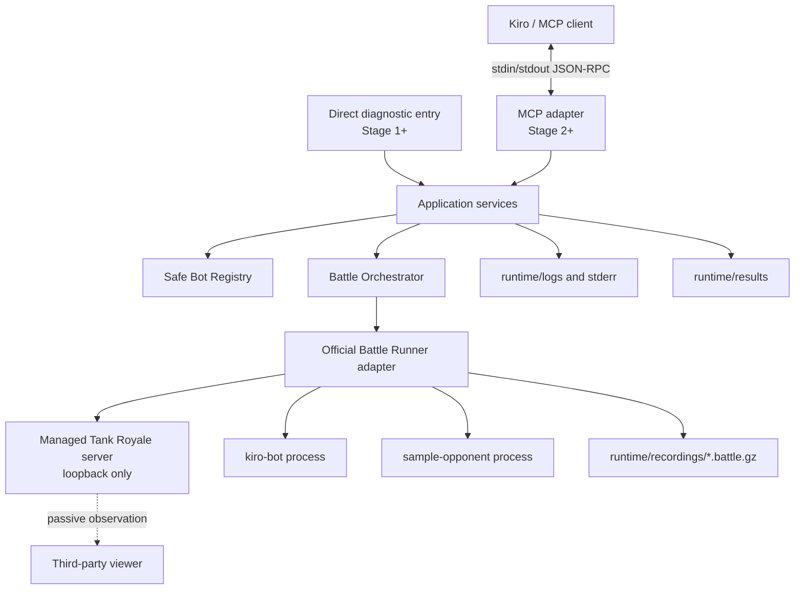
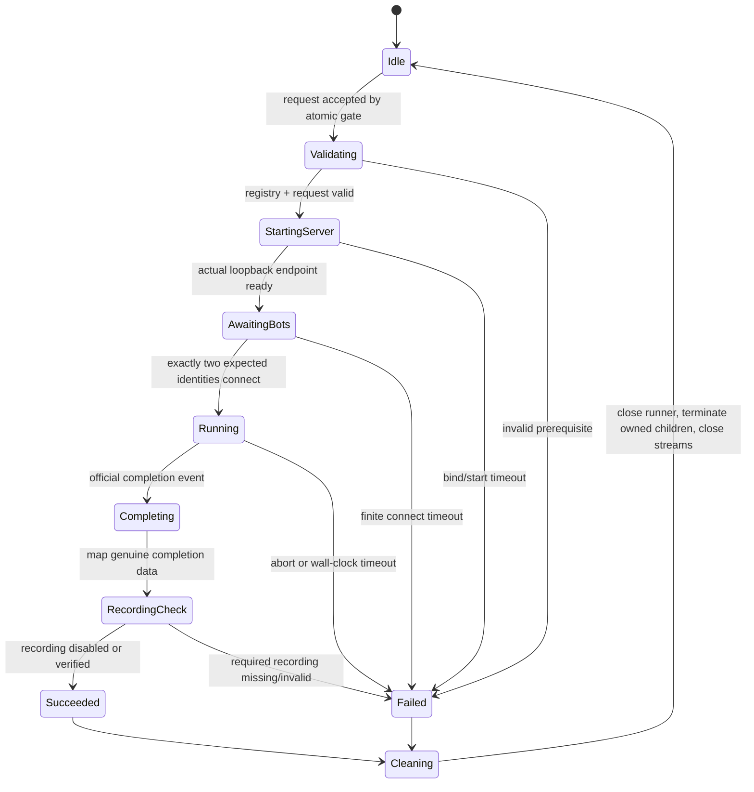

# Design Document: Kiro Royale

## Overview

Kiro Royale is a Java 21/Gradle JVM application that proves and then exposes one narrow vertical slice: two reviewed repository bots run in a genuine Robocode Tank Royale Battle Runner match, and the official completion data is returned directly or through four stdio MCP tools. The design deliberately does not assume dependency versions, artifact coordinates, Bot configuration shapes, result accessors, server-start APIs, recording APIs, or MCP Java SDK signatures. Stage 0 must verify those details against current official sources, resolve them with Gradle, pin the successful versions, and record the evidence in `DECISIONS.md` before any adapter is implemented.

The same application has two runtime modes:

- **Direct diagnostic mode** proves the Battle Runner path in Stage 1 without MCP. It starts the managed local service, launches the two registered bots as real processes, runs a battle, maps official completion data, and optionally records the battle.
- **MCP stdio mode** is added only in Stage 2. It registers exactly `get_arena_status`, `list_bots`, `inspect_bot`, and `run_battle`, and delegates `run_battle` to the already-proven application service.

No production path may use fixtures, random values, hardcoded scores, or a mock battle engine. Mocks and generated values are confined to focused unit/property tests. The MVP does not add async jobs, a second feature-parity CLI, persistence, remote bots, arbitrary bot imports, a custom viewer, tournaments, simultaneous battles, or any other feature excluded by Requirement 12.

### Goals

- Preserve Stage 0 → Stage 1 → Stage 2 → Stage 3 → Stage 4 → Stage 5 as a strict evidence-gated sequence.
- Use one Java 21/Gradle JVM application for direct diagnostics, battle orchestration, and stdio MCP serving; the official runner still launches the two Bots as required child processes.
- Run the official Battle Runner with two real bundled Bot processes on loopback.
- Return only official completion ranks and score components.
- Keep caller input at the intent level: registered Bot IDs, 1–5 rounds, and recording preference.
- Bound battle duration, bot connection time, diagnostics, and child-process output.
- Keep generated logs, results, and recordings under ignored repository-relative `runtime/` paths.
- Provide passive live-view instructions when the actual server URL is available and preserve a genuine recording for official-GUI replay when live viewing is not demonstrable.

### Non-goals

The exclusions in Requirement 12 are architectural constraints, not backlog items for this design. In particular, the MVP has no remote execution, downloads, uploads, sandboxing claim, custom viewer, browser automation, control/telemetry extensions, database, leaderboard, tournament model, concurrent battle pool, background hooks, or asynchronous MCP battle protocol. Bot code executes locally with the user's permissions and is limited to the two reviewed bundled bots.

### Research findings and Stage 0 boundary

The design was informed by these official references:

- The [official Battle Runner documentation](https://robocode.dev/api/battle-runner.html) describes a JVM-only headless runner, managed server lifecycle, synchronous battle execution, bot process launch, completion results, configurable bot-connect timeout, and optional battle recording. It also recommends deterministic resource cleanup. The exact release, dependency coordinates, method signatures, loopback controls, server URL discovery, event types, score accessors, and recording controls remain Stage 0 verification items.
- The [official MCP Java SDK server documentation](https://java.sdk.modelcontextprotocol.io/latest/server/) describes tool registration, synchronous server support, and stdio transport in the core SDK. Exact artifacts, release, transport construction, structured-content support, schema APIs, and shutdown APIs remain Stage 0 verification items.
- The [Kiro MCP configuration documentation](https://kiro.dev/docs/mcp/configuration/) is the authority for the eventual repository launcher entry. The installed Kiro version, repository-root working-directory behavior, and auto-approval behavior must be exercised in Stage 3.
- The [Tank Royale project](https://github.com/robocode-dev/tank-royale) and its official examples are the source for the two Bot configurations and Java Bot implementations. Those files are copied/adapted only after Stage 0 confirms the current format.
- The selected [third-party passive viewer](https://github.com/jandurovec/tank-royale-viewer) is an observer only. Compatibility with the actual local URL is manual Stage 3 evidence; the official Tank Royale GUI replay path is the fallback.

These findings establish capabilities and boundaries, not pinned implementation details. Research descriptions above are paraphrased for compliance with licensing restrictions.

### Strict vertical-slice sequence

```mermaid
flowchart LR
    S0[Stage 0\nVerify Java, APIs, dependencies, wrapper] -->|successful STATUS evidence| S1[Stage 1\nDirect genuine battle]
    S1 -->|real two-bot results recorded| S2[Stage 2\nExactly four stdio MCP tools]
    S2 -->|MCP discovery and real call work| S3[Stage 3\nKiro + live viewer or replay]
    S3 -->|visual proof recorded| S4[Stage 4\nFocused hardening + real smoke]
    S4 -->|tests and smoke pass| S5[Stage 5\nDocs, video, public submission]
```



A later stage cannot start because code appears plausible; it starts only after the prior stage's exact commands, exit codes, changed files, observations, remaining failures, and `not verified` claims are appended to `STATUS.md`. Stage gates are implementation-process gates and are reviewed manually rather than bypassed by build automation.

## Architecture

### System context



The application core has no MCP SDK types and no direct dependency on concrete Battle Runner types. Thin boundary adapters translate current verified external APIs into stable internal ports. This separation allows Stage 1 to prove the external adapter before Stage 2 adds MCP framing without duplicating the battle path.

### Runtime modes

| Mode | Entry behavior | stdout policy | Available operations |
|---|---|---|---|
| `direct-battle` | Stage 1 diagnostic invocation using the configured two Bot IDs; defaults are explicit in the diagnostic launcher | Human-readable diagnostic/result output is allowed because no MCP framing exists | One direct battle through `BattleService`; not a feature-parity CLI |
| `mcp-stdio` | Stage 2 server initialized with the same composition root and `BattleService` | MCP protocol bytes only; all logging goes to stderr or bounded files | Exactly the four initial MCP tools |

Mode selection is startup-owned and not exposed as an MCP parameter. Unknown modes fail before external services or child processes start. In MCP mode, no library, uncaught-exception handler, Bot stream pump, or shutdown hook may write ordinary text to stdout.

### Layering and dependency direction

```text
bootstrap / composition
    -> MCP adapter OR direct diagnostic adapter
        -> application services and internal models
            -> ports (BotCatalog, BattleEngine, RecordingStore, DiagnosticSink, Clock)
                -> filesystem and official-SDK adapters
```

- **Adapters may depend inward; application services never depend outward.**
- **External API uncertainty is isolated.** Only `OfficialBattleRunnerAdapter` and `McpStdioAdapter` change when Stage 0 confirms actual APIs.
- **The direct and MCP entry points share one composition root.** There is one registry, one battle coordinator, one timeout policy, one result mapper, and one failure sanitizer.
- **No process-wide mutable singleton contains battle results.** The only shared mutable state is the one-active-battle coordinator and the managed runner/session lifecycle it protects.

### Battle lifecycle



`BattleCoordinator` acquires the single-battle gate before validation and releases it only after cleanup. A second request observes the occupied gate and returns `BATTLE_ACTIVE`; it never queues or starts work. The call uses a dedicated executor so a finite wall-clock deadline can trigger cancellation and lifecycle closure even if the verified synchronous runner call blocks. Timeouts are positive application configuration constants (or trusted startup configuration), never MCP fields.

The adapter owns every resource it creates. Cleanup executes in `finally`/try-with-resources semantics on success, validation failure after acquisition, server failure, Bot startup failure, recording failure, timeout, MCP shutdown, and JVM shutdown. The adapter first invokes the official verified close/stop mechanism, then closes stream pumps and terminates any still-live child processes that the application started. It waits only for a bounded grace period before forced termination. It never enumerates or kills unrelated system processes. Stage 0 must determine how the current runner exposes process ownership and shutdown; if ownership cannot be proven, Stage 1 remains blocked rather than inventing cleanup behavior.

Child stdout/stderr is consumed concurrently to prevent pipe deadlock. Each stream uses a bounded tail/ring buffer with a configured byte/line limit. Overflow discards older or excess diagnostic data and adds a truncation marker. Bot output never passes through MCP stdout. Detailed diagnostics may be written under `runtime/logs/`, subject to the same finite policy and secret redaction.

### Server and viewer lifecycle

The managed Tank Royale service binds to an explicitly verified loopback setting. A dynamic port is preferred only if the current API can return the actual WebSocket URL; otherwise Stage 0 must verify a safe fixed-loopback configuration. No MCP caller can provide a host, port, or URL.

The lifecycle exposes the actual URL only after readiness is confirmed. `get_arena_status` returns that value while a managed server/session is available and `null` otherwise; it never guesses a default port. For the Stage 3 demonstration, the server/session is made ready before the battle starts, the actual URL is shown to the reviewer, and the passive viewer is connected first. Whether the verified runner can remain ready across `get_arena_status` and `run_battle`, or instead supplies a pre-battle readiness callback/window, is a Stage 0/1 adapter decision. If the verified API cannot provide a reliable live-observation window, the design does not add a custom server or control plane: recording remains enabled and the same battle is played manually in the official GUI.

### Repository-relative runtime layout

```text
<repository-root>/
├── bots/
│   ├── kiro-bot/
│   └── sample-opponent/
├── runtime/
│   ├── logs/
│   ├── recordings/
│   └── results/
└── src/...
```

The composition root resolves `Repository_Root` from a verified launcher contract, not from a machine-specific absolute constant. Internal filesystem operations use absolute normalized/canonical paths, while every client response and committed configuration uses repository-relative `/`-separated paths. Generated filenames use application-owned IDs/timestamps, never caller path fragments. Runtime directories are created beneath the canonical repository `runtime/` root, and response paths are relativized only after containment is checked.

## Components and Interfaces

Package names below are logical boundaries; exact class signatures may be adjusted during implementation without weakening the contracts.

### Bootstrap and configuration

**`KiroRoyaleApplication`**

- Parses only the trusted startup mode and trusted local configuration.
- Locates and canonicalizes the repository root.
- Constructs one object graph for registry, runtime paths, timeout policy, official runner adapter, battle service, failure mapper, and selected outer adapter.
- Installs cleanup hooks without printing to stdout in MCP mode.
- Rejects unknown mode/configuration before opening a service or starting a process.

**`VerifiedIntegrationConfiguration`**

Contains application version, Java baseline, Stage-0-pinned external versions, positive Bot-connect timeout, positive battle wall-clock timeout, cleanup grace period, output limits, loopback binding, and runtime roots. External coordinates and API bindings are not represented in this design; Stage 0 places verified values in Gradle and `DECISIONS.md`.

### Safe Bot registry

**`BotRegistry`** implements the internal `BotCatalog` port.

```java
interface BotCatalog {
    List<BotDescriptor> list();
    BotInspection inspect(BotId id);
    ValidatedBot resolveValidated(BotId id);
}
```

The static registry contains exactly `kiro-bot` and `sample-opponent` for the MVP. Callers never provide a path, process command, environment map, host, or repository URL. Registry initialization performs this containment algorithm:

1. Resolve the configured `bots/` root against the repository root and obtain its canonical real path.
2. Resolve each application-owned relative Bot directory against that root.
3. Normalize and obtain the candidate's real path, following links so symlink escapes are visible.
4. Require `candidateRealPath.startsWith(botRootRealPath)` and require the candidate to be a directory.
5. Load only the current Stage-0-verified Bot metadata/configuration files; do not recursively discover executables outside the registered directory.
6. Store both the canonical internal path and repository-relative display path.

Missing/unreadable paths, symlink escapes, invalid current-format Bot configuration, absent editable source, or mismatched identity produce validation issues and prevent battle launch. Merely listing/inspecting a registered invalid Bot is allowed so the issue can be diagnosed; resolving it for battle is not.

### Bot validation

**`BotValidator`** validates only application-configured facts confirmed from official examples:

- directory containment and readability;
- required current Bot configuration and identity fields;
- expected registered name/version;
- repository-relative primary editable source for `kiro-bot`;
- verified build/run information without executing caller text;
- files needed by the current official Bot launcher.

The implementation must not infer current configuration filenames or command fields from this design. Stage 0/1 supplies those details from official examples.

### Battle application service

**`BattleService`** is the sole use case invoked by both runtime modes.

```java
interface BattleService {
    BattleOutcome run(BattleRequest request);
    ArenaStatus status();
}
```

Responsibilities:

- apply defaults (`rounds = 1`, `record = true`) before domain validation;
- require exactly two distinct registered IDs and rounds in `[1, 5]`;
- atomically enforce one active battle;
- validate both Bots before external work;
- allocate contained log/result/recording paths;
- invoke `BattleEngine` once with validated application-owned launch metadata;
- enforce connection and wall-clock deadlines;
- map only successful official completion data;
- verify an enabled recording before claiming it;
- persist optional lightweight diagnostic result JSON under `runtime/results/` without making it authoritative;
- always perform cleanup and release the active gate.

### One-active-battle coordinator

**`BattleCoordinator`** uses a fair binary semaphore or atomic compare-and-set state with no request queue. Its observable state is `IDLE` or one active lifecycle phase. Acquisition and state transition are atomic; status reads use the same state source. Internal phase detail may be logged but MCP exposes only `battleActive` to avoid adding a job/status API.

### Official Battle Runner boundary

**`BattleEngine`** is an internal port:

```java
interface BattleEngine extends AutoCloseable {
    EngineBattleCompletion run(ValidatedBattleSpec spec, BattleObserver observer);
    Optional<LoopbackEndpoint> readyEndpoint();
    void abort();
}
```

This is a design contract, not a claim about official API signatures. `OfficialBattleRunnerAdapter` translates it to the Stage-0-verified API. It configures an official managed server on loopback, a finite non-caller-controlled Bot connection timeout, the requested 1–5 rounds, exactly two validated Bot entries, and an optional contained recording target. It emits endpoint readiness for status/viewer instructions, captures the official completion/abort distinction, and owns runner/process cleanup.

`BattleObserver` receives only lifecycle facts needed for bounded diagnostics and proof (server ready, expected Bot connected, battle started, official completion, recording produced). Per-turn telemetry and intent diagnostics are excluded.

### Genuine result mapper

**`GenuineResultMapper`** accepts only `EngineBattleCompletion` carrying the verified official successful-completion marker and official result objects. It:

1. rejects absent, aborted, timed-out, or non-success completion;
2. requires exactly two results matching the selected configured name/version identities;
3. maps rank, name, version, total score, survival score, bullet damage, ram damage, first places, and rounds played from the corresponding official completion fields verified in Stage 0;
4. orders the mapped results by ascending official rank;
5. rejects missing fields, duplicate/invalid ranks, identity mismatches, or inconsistent round counts rather than filling values;
6. attaches provenance `OFFICIAL_BATTLE_RUNNER_COMPLETION` internally so tests can distinguish the real adapter path from test doubles.

It never computes score components, predicts winners, substitutes zero, or reads `runtime/results/` to answer a production battle call.

### Recording store

**`RecordingStore`** creates unique recording targets below canonical `runtime/recordings/`, checks containment, and verifies after completion that the expected `.battle.gz` is a regular non-empty file (plus any current-format validation supported by the verified API). If `record=false`, no recording is required or claimed. If `record=true`, a missing or failed recording converts the entire call to a sanitized recording failure even when score completion exists, matching Requirement 7.6. Partial files may remain only as ignored diagnostics and are never returned as successful replay paths.

### MCP stdio adapter

**`McpStdioAdapter`** is added only after direct Stage 1 proof. It uses the Stage-0-verified official Java SDK APIs and registers exactly four tool specifications:

| Tool | Input | Application delegation | Read-only |
|---|---|---|---|
| `get_arena_status` | empty object; additional properties rejected | `BattleService.status()` plus prerequisite probe | yes |
| `list_bots` | empty object; additional properties rejected | `BotCatalog.list()` | yes |
| `inspect_bot` | exactly `botId` string | `BotCatalog.inspect(...)` | yes |
| `run_battle` | only `botIds`, optional `rounds`, optional `record`, optional `showBattle`; additional properties rejected | `BattleService.run(...)` | no |

Every successful tool result contains a concise summary plus JSON-compatible structured fields using the representation supported by the verified SDK. Every failure uses one structured sanitized contract. Schema validation occurs before domain invocation, so invalid shape cannot acquire the battle gate or launch a process.

The adapter owns stdin/stdout protocol transport. A dedicated logging configuration routes framework/application diagnostics to stderr or `runtime/logs/`. Startup banners and direct-mode printers are disabled in MCP mode. Tool handlers catch the outermost exception and invoke `FailureSanitizer`; uncaught stack traces are logged only to bounded local diagnostics and never included in tool content.

### Direct diagnostic adapter

**`DirectBattleDiagnostic`** is the smallest Stage 1 shell around `BattleService`. It selects the two configured Bundled Bot IDs and invokes a real one-round battle by default. It may print the actual pre-battle endpoint, lifecycle observations, and final genuine results because this mode does not carry MCP. It accepts no arbitrary Bot path, executable, environment override, host, or URL and does not grow into feature parity with MCP.

### Failure sanitizer

**`FailureSanitizer`** maps typed domain/adapter failures to a fixed code, safe message, retryability, and optional repository-relative details. Expected codes include:

- `INVALID_REQUEST`, `UNKNOWN_BOT`, `BOT_INVALID`, `UNSAFE_BOT_PATH`;
- `BATTLE_ACTIVE`, `SERVER_CONNECTION_FAILED`, `BOT_START_FAILED`;
- `BATTLE_ABORTED`, `BATTLE_TIMEOUT`, `RECORDING_FAILED`;
- `INTERNAL_ERROR`.

Messages identify the failed prerequisite or lifecycle state without stack traces, absolute paths, command lines, environment values, raw child output, credentials, or arbitrary exception messages. A correlation ID may connect the client failure to bounded local logs. Failure results never contain a success flag set to true, ranked results, or a claimed recording.

### Status and prerequisite probe

**`ArenaStatusService`** reports application/Java/verified Robocode versions, `bots`, count, active state, actual ready loopback WebSocket URL or `null`, viewer instructions, `runtime/recordings`, and blocking prerequisites. It performs bounded local checks only; it does not launch a battle, mutate Bot source, open a browser, or claim viewer connectivity.

## Data Models

The following are internal records/value objects. Names and Java syntax are illustrative internal contracts, not external API signatures.

### Identity and Bot models

```java
record BotId(String value) {}

record BotDescriptor(
    BotId id,
    String name,
    String version,
    String language,
    RepoRelativePath directory,
    ValidationStatus validationStatus,
    String sourceLabel
) {}

record BotInspection(
    BotDescriptor descriptor,
    List<RepoRelativePath> sourceFiles,
    RepoRelativePath primaryEditableSource,
    BuildInfo build,
    RunInfo run,
    List<ValidationIssue> issues
) {}

record ValidatedBot(
    BotDescriptor descriptor,
    Path canonicalDirectory,
    VerifiedBotLaunchMetadata launchMetadata
) {}
```

`BotId` accepts only exact registered IDs. `RepoRelativePath` is a serialization-safe path that cannot be absolute or contain traversal. `VerifiedBotLaunchMetadata` is application-owned data parsed from the Stage-0-verified configuration; it is never populated from MCP-supplied commands.

### Battle request and state

```java
record BattleRequest(
    List<BotId> botIds,
    int rounds,
    boolean record
) {}

enum BattlePhase {
    IDLE, VALIDATING, STARTING_SERVER, AWAITING_BOTS,
    RUNNING, COMPLETING, RECORDING_CHECK, CLEANING
}

record ValidatedBattleSpec(
    List<ValidatedBot> bots,
    int rounds,
    Optional<Path> canonicalRecordingTarget,
    Duration botConnectTimeout,
    Duration wallClockTimeout
) {}
```

Transport decoding distinguishes omitted defaults from malformed values before constructing `BattleRequest`. Non-integer rounds, duplicate IDs, wrong participant count, unknown fields, and wrong JSON types never become a domain request.

### Genuine completion and result

```java
record EngineBattleCompletion(
    CompletionKind kind,
    List<EngineResult> officialResults,
    int officialRoundsPlayed,
    CompletionProvenance provenance
) {}

record BattleResult(
    int rank,
    String name,
    String version,
    long totalScore,
    long survivalScore,
    long bulletDamage,
    long ramDamage,
    int firstPlaces,
    int roundsPlayed
) {}

record BattleSuccess(
    int roundsPlayed,
    List<BattleResult> results,
    Optional<RepoRelativePath> recordingPath
) implements BattleOutcome {}
```

Numeric Java types are finalized in Stage 0 from official result types. Mapping must be lossless; if an official component cannot be represented safely, the internal model is widened rather than truncated. `CompletionProvenance` is set by the production adapter only after a real official completion event.

### Tool response contracts

Success responses use stable camel-case JSON-compatible fields and a short summary. The result representation is finalized against the verified SDK.

`get_arena_status` data:

```json
{
  "ready": true,
  "applicationVersion": "resolved application version",
  "javaVersion": "actual runtime version",
  "robocodeVersion": "Stage-0-pinned version",
  "botRoot": "bots",
  "botCount": 2,
  "battleActive": false,
  "websocketUrl": null,
  "viewerInstructions": "connect only when the actual URL is reported; otherwise use replay fallback",
  "recordingDirectory": "runtime/recordings",
  "blockingPrerequisites": []
}
```

`list_bots` returns `bots[]` with `id`, `name`, `version`, `directory`, `language`, `validationStatus`, and `sourceLabel`.

`inspect_bot` returns `bot`, repository-relative `sourceFiles[]`, `primaryEditableSource`, structured `build`, structured `run`, and `validationIssues[]`. Build/run data describes the reviewed bundled configuration; it is not a caller-executable command interface.

`run_battle` success data:

```json
{
  "success": true,
  "roundsPlayed": 1,
  "results": [
    {
      "rank": 1,
      "name": "official completion name",
      "version": "official completion version",
      "totalScore": 123,
      "survivalScore": 50,
      "bulletDamage": 60,
      "ramDamage": 13,
      "firstPlaces": 1,
      "roundsPlayed": 1
    }
  ],
  "recordingPath": "runtime/recordings/application-owned-name.battle.gz"
}
```

The numbers illustrate JSON types only and are never production defaults or fixture responses. A real successful response has exactly two entries sourced from the official completion.

Failure data:

```java
record SanitizedFailure(
    String code,
    String message,
    boolean retryable,
    String correlationId,
    Map<String, Object> safeDetails
) implements BattleOutcome {}
```

Only allowlisted safe detail keys are serialized. Failure shape does not include results or recording claims.

### Runtime artifact metadata

```java
record RuntimeArtifact(
    ArtifactKind kind,
    Path canonicalPath,
    RepoRelativePath displayPath,
    long boundedSize
) {}
```

Canonical paths remain internal. Result diagnostic files are non-authoritative evidence aids; MCP success is built from in-memory official completion data, not from those files.

## Correctness Properties

*A property is a characteristic or behavior that should hold true across all valid executions of a system—essentially, a formal statement about what the system should do. Properties serve as the bridge between human-readable specifications and machine-verifiable correctness guarantees.*

The property-based testing strategy applies to Kiro Royale's pure request normalization, schema/domain validation, canonical path containment, state coordination, result projection, artifact allocation, bounded buffering, redaction, and failure sanitization. It does not establish that the external Battle Runner, Bot processes, MCP transport, Kiro UI, viewer, replay player, build, or publication works; those require the integration and manual checks in the Testing Strategy.

### Property 1: Omitted battle options normalize to safe defaults

For any structurally valid `run_battle` request containing exactly two distinct registered Bot IDs, omission of `rounds`, `record`, and/or `showBattle` shall normalize the omitted values to `1`, `true`, and `false` respectively, while supplied valid option values shall be preserved.

**Validates: Requirements 5.5, 5.6, 5.7, 5.8**

### Property 2: Only the strict battle request domain can launch an engine

For any JSON-compatible candidate request, the engine shall be invokable if and only if the object contains no keys other than `botIds`, `rounds`, `record`, and `showBattle`, contains exactly two distinct registered Bot IDs, has an omitted or integer round count in the inclusive range 1 through 5, and has omitted or Boolean recording/viewer values; every other candidate shall produce a sanitized failure with zero engine invocations.

**Validates: Requirements 5.9, 5.10, 5.12, 5.13, 6.5, 6.6, 9.3, 9.4**

### Property 3: Registered Bot resolution is canonical and contained

For any registered or unregistered Bot ID and any generated temporary filesystem arrangement including `.` segments, `..` segments, and symbolic links, resolution shall succeed only for a registered application-owned Bot mapping whose canonical real directory is a descendant of the canonical repository `bots/` root; unknown IDs and canonical escapes shall always fail without returning a launchable Bot.

**Validates: Requirements 6.1, 6.2, 6.3, 6.4, 9.1, 9.2**

### Property 4: Valid official two-Bot completions produce exactly two ordered results

For any successful official completion containing the two expected Bot identities and two valid distinct ranks, mapping shall return exactly two results ordered by ascending official rank, independent of the order in which the adapter supplies those result records.

**Validates: Requirements 3.7, 5.14**

### Property 5: Genuine result mapping is lossless

For any representable successful official completion result, the mapped result shall preserve that same result's rank, name, version, total score, survival score, bullet damage, ram damage, first places, and rounds played without calculation, substitution, truncation, or cross-Bot mixing.

**Validates: Requirements 3.8, 5.15, 7.1**

### Property 6: Non-genuine or non-success completion can never become success

For any absent, failed, aborted, timed-out, malformed, wrong-cardinality, identity-mismatched, or non-official-provenance completion, result mapping shall return a failure and shall not return ranked results or a successful recording claim.

**Validates: Requirements 3.10, 7.2, 7.5, 7.8**

### Property 7: Runtime artifacts remain contained and recording claims are truthful

For any application-generated artifact identity and artifact kind, the canonical target shall remain beneath the canonical repository `runtime/` root; additionally, a recording path shall appear in a successful battle response if and only if recording was requested and a contained, regular, non-empty recording was verified at the expected target.

**Validates: Requirements 5.8, 5.16, 6.9, 7.6**

### Property 8: At most one battle owns the active gate

For any set of two or more overlapping battle requests and any lifecycle phase held by the first accepted request, exactly one request shall own the battle gate, status shall report `battleActive=true` until that owner completes cleanup, and every other overlapping request shall receive a sanitized `BATTLE_ACTIVE` failure without invoking the engine.

**Validates: Requirements 5.17, 5.18**

### Property 9: Arena status projection is complete and does not invent endpoints

For any internal arena/prerequisite state, the status response shall contain every required status field, shall reflect the same active state and registered Bot count, and shall contain a WebSocket URL if and only if the managed server has reported an actual ready loopback endpoint.

**Validates: Requirements 5.2**

### Property 10: Bot listing is a lossless safe projection

For any registry state, `list_bots` shall return one entry per registered Bot and each entry shall preserve its ID, name, version, repository-relative directory, language, validation status, and source label without exposing a canonical absolute path.

**Validates: Requirements 5.3**

### Property 11: Bot inspection is a lossless safe projection

For any registered Bot inspection, `inspect_bot` shall preserve its metadata, repository-relative source files, primary editable source, structured build/run information, and validation issues without exposing an absolute path or introducing caller-executable input.

**Validates: Requirements 5.4**

### Property 12: Every tool success has dual human and machine representations

For any successful domain output from any of the four tools, MCP serialization shall produce a nonblank concise human summary and JSON-compatible structured fields that round-trip through the selected JSON representation without losing the tool's required values.

**Validates: Requirements 5.1**

### Property 13: Timeout policy is finite, positive, and caller-immutable

For any candidate Bot-connect and battle wall-clock durations, timeout-policy construction shall succeed only when both are strictly positive and finite, and no accepted MCP request shall alter either configured value.

**Validates: Requirements 6.13, 6.14**

### Property 14: Captured output is always bounded

For any finite or streamed sequence of child-process output chunks and any configured positive capture limit, the retained diagnostic content shall never exceed that limit plus a fixed truncation marker, shall indicate when truncation occurred, and shall never be written by the capture component to MCP stdout.

**Validates: Requirements 6.15**

### Property 15: Diagnostic redaction removes configured secrets

For any diagnostic text and any configured non-empty set of secret values, the emitted diagnostic representation shall contain none of those secret values while retaining a safe indication that redaction occurred.

**Validates: Requirements 6.11**

### Property 16: Boundary failures are sanitized and result-free

For any Bot validation/startup failure, server connection failure, battle terminal failure, recording failure, or internal exception—including exception messages containing stack traces, absolute paths, commands, environment values, or secrets—the MCP boundary shall return an allowlisted actionable failure code/message without unsafe details, successful results, or a recording claim.

**Validates: Requirements 7.3, 7.4, 7.5, 7.6, 7.7, 9.5**

## Error Handling

### Error model

Application code uses typed failures internally and converts them once at the outer runtime boundary. Expected validation and lifecycle failures do not rely on raw exception text. Unexpected exceptions retain their cause only in bounded local diagnostics and are mapped to `INTERNAL_ERROR` for the client.

| Failure point | Internal category | Client behavior | Required cleanup |
|---|---|---|---|
| Malformed/extra MCP input | request validation | `INVALID_REQUEST`; no engine call | none beyond request objects |
| Unknown/path-like Bot ID | registry lookup | `UNKNOWN_BOT` or `INVALID_REQUEST` | none |
| Canonical path escape or invalid Bot | prerequisite validation | `UNSAFE_BOT_PATH` or `BOT_INVALID` | release active gate if acquired |
| Second overlapping battle | concurrency gate | retryable `BATTLE_ACTIVE` | no queue, no engine call |
| Managed server bind/readiness/connect failure | engine startup | `SERVER_CONNECTION_FAILED` | close runner/session and owned streams/processes |
| Bot launch/connect failure | engine startup | `BOT_START_FAILED` | terminate all children owned by this battle |
| Official abort/non-success | battle execution | `BATTLE_ABORTED` | abort/close runner; terminate owned children |
| Wall-clock deadline | battle execution | retryable `BATTLE_TIMEOUT` | cancel worker, abort/close, bounded graceful then forced child termination |
| Missing/invalid required replay | recording verification | `RECORDING_FAILED` | close resources; do not claim artifact |
| Result cardinality/identity/provenance mismatch | result mapping | `BATTLE_ABORTED` or safe integration failure | close resources; omit all success data |
| Unexpected exception | any tool boundary | `INTERNAL_ERROR` with correlation ID | execute the same `finally` cleanup path |
| MCP/JVM shutdown | process lifecycle | transport closes; no fabricated response | abort active battle and clean all application-owned children |

### Cleanup guarantees

Cleanup is idempotent so timeout cancellation, normal `finally`, MCP close, and JVM shutdown may race safely. The order is:

1. mark the battle no longer able to publish success;
2. ask the verified official runner to abort/close;
3. cancel the battle worker and close process stream pumps;
4. request graceful termination of still-live application-owned children;
5. wait for the configured finite grace period;
6. forcibly terminate only remaining application-owned children;
7. close files/executors/session resources;
8. release the one-battle gate and publish `IDLE`.

Cleanup failures are logged safely and cannot convert an unsuccessful battle into success. If cleanup after an otherwise successful completion cannot establish that owned children stopped, the result is not emitted until cleanup reaches a safe terminal state; persistent cleanup failure is returned as a sanitized internal/lifecycle failure.

### MCP protocol integrity

- MCP mode installs stdout as a protocol-owned sink before SDK/server initialization.
- Human result printers exist only in direct diagnostic mode.
- Logging backends are configured before any MCP component logs.
- Child output uses dedicated stderr/file sinks and bounded buffers.
- Tool errors are represented through the verified SDK's error/result mechanism; raw JSON is not manually interleaved with SDK output.
- Tests parse captured stdout as protocol traffic and deliberately trigger diagnostics to detect contamination.

### Recording and visual-proof failures

Viewer unavailability does not make a genuine recorded battle fail, because the viewer is passive and outside battle execution. It does prevent Live Viewer Proof. A recording requested by `run_battle`, however, is part of that request's success contract; recording failure makes the call fail. The reviewer then either demonstrates the live battle or loads and plays that same successful battle's recording in the official GUI. File existence alone is not Replay Proof.

## Testing Strategy

### Test layers

1. **Property-based tests** cover pure, broad-input invariants from the Correctness Properties section.
2. **Focused example-based unit tests** cover concrete defaults, boundary examples, call order, and failure categories without multiplying cases already covered by generators.
3. **Adapter/contract tests** verify MCP framing, stdout/stderr separation, JSON schema behavior, filesystem effects, and controlled process cleanup.
4. **One real integration smoke test** uses the current official Battle Runner and both real bundled Bot processes for one round.
5. **Manual verification** establishes Kiro UI connection, live viewing/replay playback, stage evidence, publication, and video claims that automation cannot credibly prove.

A mocked/fake `BattleEngine` is allowed only for application-unit and property tests. It is never accepted as direct battle proof, Real Integration Smoke Test proof, Genuine Result proof, or demo evidence.

### Property-based testing

Use **jqwik** on the JUnit Platform for Java property-based tests. Stage 0 must resolve and pin a Java 21-compatible jqwik release before tests are implemented; this document intentionally does not invent its version or coordinates. Each numbered correctness property is implemented by exactly one property test with at least 100 tries. A test comment/tag uses this format:

```text
Feature: kiro-royale, Property <number>: <property title/body>
```

Generators include:

- JSON-compatible request objects with omitted fields, wrong types, extra keys, arbitrary Bot ID strings, duplicates, and round boundaries;
- temporary directory trees with nested paths, traversal segments, and symbolic links where the host supports them;
- result permutations, score boundaries, identity mismatches, cardinality errors, completion kinds, and provenance values;
- lifecycle phase/overlap schedules for the binary battle gate;
- repository-relative artifact names and hostile path fragments (used only as generated test inputs, never production caller paths);
- output chunks around capture limits, Unicode, line boundaries, and large streams;
- exceptions/diagnostics containing generated secrets, absolute-path-like text, command-like text, and stack-like text;
- positive, zero, negative, and effectively unbounded duration candidates.

Filesystem properties use isolated temporary roots and explicitly skip only unsupported symlink creation with a reported test assumption; a fixed symlink-escape example remains required on supported developer/CI hosts. Concurrency properties use bounded deterministic synchronization rather than timing sleeps.

### Focused unit and contract tests

Example-based tests should remain small and target cases whose meaning is clearer concretely:

- rounds `0`, `1`, `5`, and `6`; duplicate IDs; non-integer rounds; one unexpected property;
- unknown `botId` for `inspect_bot` and `run_battle`;
- invalid Bot prevents `BattleEngine.run` from being called;
- `record=false` does not allocate/claim a recording;
- one representative exception per typed failure code;
- shutdown/timeout cleanup with controlled child processes owned by the test;
- direct mode may write human output, while MCP mode may not;
- MCP tool discovery returns exactly the four initial names;
- MCP success includes both text and structured content using the verified SDK representation;
- no-input tools and `inspect_bot` reject unexpected properties;
- status exposes `null` rather than a guessed WebSocket URL before readiness.

Architecture/static checks or code review verify that production process launch uses an argument-list API with no shell, that no caller-supplied environment/host/URL/command reaches launch configuration, and that only read-only tools are eligible for Kiro auto-approval.

### Real Integration Smoke Test

The Stage 4 smoke test is opt-in if necessary for local environment cost, but it must be executable and must actually be run before Stage 4 can pass. It:

1. builds the Java application and both bundled Bots with Stage-0-pinned dependencies;
2. validates both Bots using the production registry/validator;
3. invokes the production official Battle Runner adapter, not a mock or fixture;
4. starts the managed service on loopback with finite timeouts;
5. launches both real Bot processes;
6. runs exactly one round;
7. observes the verified official successful-completion event/provenance;
8. asserts exactly two ascending ranked results;
9. asserts returned names/versions equal the registered Bot configuration;
10. asserts every required score component was mapped from completion data;
11. when recording is enabled, verifies the contained non-empty real `.battle.gz` artifact;
12. verifies owned child processes are no longer alive after cleanup.

The test must not assert that repeated runs have identical ranks or scores. A successful property/unit suite cannot substitute for this smoke test.

### Stage-specific verification

| Stage | Automated/command evidence | Manual/repository evidence | Exit boundary |
|---|---|---|---|
| 0 | Java 21 check, Gradle Wrapper, dependency resolution, trivial compile/run using verified official APIs | Official source links and resolved values recorded in `DECISIONS.md` | No Battle abstractions before success evidence |
| 1 | Direct diagnostic executes one genuine battle; optional recording checked | Observe actual loopback endpoint, real Bot processes, two official results; update `STATUS.md` | No MCP implementation before direct proof |
| 2 | MCP handshake/discovery, schema/stream contract tests, real `run_battle` through same service | Confirm exactly four tools and synchronous behavior | No Kiro/viewer claim from unit tests |
| 3 | Verified repository-root launcher | Reviewer connects Kiro, calls all tools, connects passive viewer before battle or plays same replay in official GUI | Stage incomplete without Live Viewer Proof or Replay Proof |
| 4 | Property/unit/contract suite and real one-round integration smoke | Review cleanup and safety evidence | Mock-only success is insufficient |
| 5 | Re-run evidenced build/test/direct/MCP commands in fresh-checkout-like state | README, tracked-file/secret hygiene, public repo, ≤3 minute video, submission links | Each final claim reported separately or `not verified` |

Every stage appends exact commands, exit codes, changed files, observed output/manual observations, remaining failures, and unverified claims to `STATUS.md` before the next stage begins.

### Manual verification boundaries

The following cannot be claimed solely from automated tests or code inspection:

- the installed Kiro version starts the repository-relative launcher and shows the MCP server connected;
- Kiro discovers and invokes each of the four tools;
- the synchronous `run_battle` duration fits the observed Kiro tool timeout;
- the third-party viewer connects to the actual reported loopback WebSocket URL before battle and passively displays the same battle;
- if live proof fails, the official GUI loads and plays the same generated recording;
- Bot strategy behavior is visually credible and the demo correlates Kiro output with the genuine battle;
- the public repository and video URLs are accessible;
- the final video is at most three minutes and shows the required sequence;
- official challenge terms/deadlines remain current;
- a fresh-checkout-like setup works on the reviewer host;
- tracked files are free of secrets, generated artifacts, machine-specific paths, and build output.

When any item is not exercised, `STATUS.md` and final reporting say `not verified`; existence of code, configuration, URL text, or a replay file is not equivalent to manual proof.

### Requirement traceability

| Requirement | Design coverage | Primary verification |
|---|---|---|
| 1.1–1.12 | Strict vertical-slice sequence; stage-specific verification | `STATUS.md`, VCS, and reviewer stage gates |
| 2.1–2.8 | Research/Stage 0 boundary; bootstrap/configuration | Java/Gradle/dependency resolution and `DECISIONS.md` |
| 3.1–3.11 | Direct mode; Bot registry/validator; Battle lifecycle; genuine mapper; recording store | Stage 1 direct real battle plus Properties 4–6 |
| 4.1–4.8 | Runtime modes; MCP stdio adapter; shared `BattleService` | MCP discovery/transport integration and Stage 2 real call |
| 5.1–5.18 | Tool table; response models; normalization; coordinator | Properties 1–2 and 7–12 plus MCP contracts |
| 6.1–6.15 | Canonical registry; loopback; process/output lifecycle; runtime layout | Properties 3, 7, 13–15; controlled process tests; real smoke |
| 7.1–7.8 | Genuine mapper; failure sanitizer; recording policy | Properties 5–7 and 16; real official completion evidence |
| 8.1–8.14 | Server/viewer lifecycle; Stage 3 boundary | Manual Kiro + live viewer or same-battle official-GUI replay |
| 9.1–9.13 | Property/unit strategy and Real Integration Smoke Test | Stage 4 test reports and genuine smoke evidence |
| 10.1–10.11 | Repository-relative layout; Stage 5 verification/manual boundaries | Fresh-checkout-like run, docs/repository/publication review |
| 11.1–11.8 | Manual verification boundaries and Stage 5 exit | Reviewer inspection of published ≤3 minute demo |
| 12.1–12.3 | Non-goals; exact four-tool scope; synchronous-only design | Repository/tool inventory and absence of timeout evidence for async |

This traceability intentionally assigns external and visual requirements to integration/manual evidence rather than overstating what property tests can prove.
